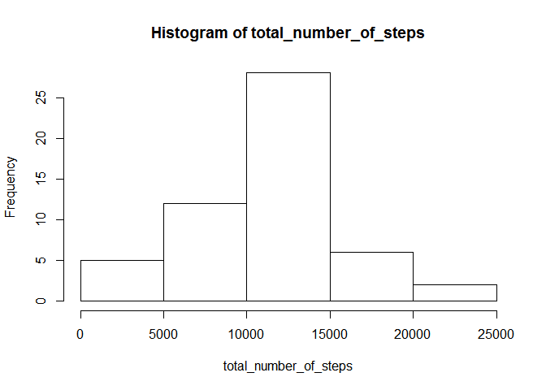
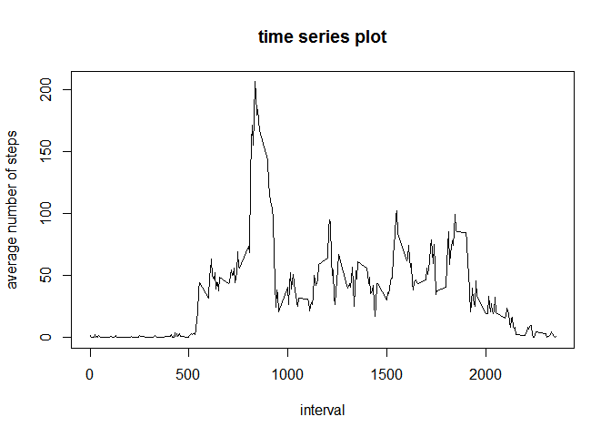
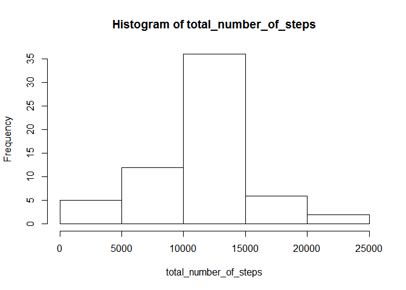
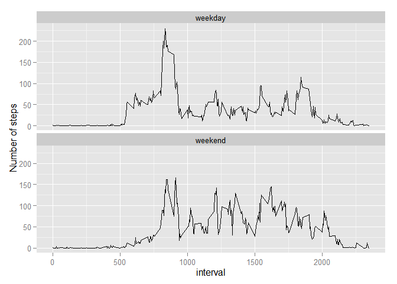

# Reproducible Research: Peer Assessment 1


## Loading and preprocessing the data


```r
# read repdata-data-activity.zip and store as data rame
source_df=read.csv(unz("activity.zip","activity.csv")) 
```

## What is mean total number of steps taken per day?


```r
# split data frame by day
df_date<-split(source_df, source_df$date)
# collect sum of steps per day
total_number_of_steps<-NULL
for ( i in 1:length(df_date) ) {
  sum<-sum(df_date[[i]]$steps)
  if (!is.na(sum)) {
  total_number_of_steps<-c(total_number_of_steps, sum)
  }
}
mean_date<-mean(total_number_of_steps)
median_date<-median(total_number_of_steps)
```
0. The totoal number of steps taken per day is:  
126, 11352, 12116, 13294, 15420, 11015, 12811, 9900, 10304, 17382, 12426, 15098, 10139, 15084, 13452, 10056, 11829, 10395, 8821, 13460, 8918, 8355, 2492, 6778, 10119, 11458, 5018, 9819, 15414, 10600, 10571, 10439, 8334, 12883, 3219, 12608, 10765, 7336, 41, 5441, 14339, 15110, 8841, 4472, 12787, 20427, 21194, 14478, 11834, 11162, 13646, 10183, 7047
  
1. The histogram of the total number of steps taken each day is as shown:

```r
hist(total_number_of_steps)
```

 

2. mean is 1.0766189\times 10^{4}, median is 10765


## What is the average daily activity pattern?


```r
# split data frame by interval
df_interval<-split(source_df, source_df$interval)
# collect mean of steps per interval
average_number_of_steps<- NULL
for ( i in 1:length(df_interval) ) {
  # calculate mean with ignore NA
  mean<-mean(df_interval[[i]]$steps, na.rm=TRUE)
  if (!is.na(mean)) {
  average_number_of_steps<-c(average_number_of_steps, mean)
  }
}
# check the interval with max mean vlaue
target_interval<-names(df_interval)[average_number_of_steps==max(average_number_of_steps)]
```

1. time series plot of the 5-minute interval and the average number of steps taken, averaged across all days:  

```r
plot(names(df_interval),average_number_of_steps,type="l", main="time series plot", xlab="interval", ylab="average number of steps")
```

 
  
2. The 5-minute interval contains the maximum number of steps is 835
  
## Imputing missing values


```r
# 1. calculate the NA counts
na_count<-sum(is.na(source_df$steps))

# 2/3. use mean of intervals to fill all NA and create new dataset
  # copy source_df to new one
new_source_df<-source_df
  # assign "the mean for that 5-minute interval" to the NA values of the interval
for (i in 1:length(new_source_df$steps)) {
  if (is.na(new_source_df$steps[i])) {
    new_source_df$steps[i]<-average_number_of_steps[((i-1)%%(length(average_number_of_steps)))+1]
  }
}

# 4. re-calculate
df_date<-split(new_source_df, new_source_df$date)
total_number_of_steps<-NULL
for ( i in 1:length(df_date) ) {
  sum<-sum(df_date[[i]]$steps)
  if (!is.na(sum)) {
  total_number_of_steps<-c(total_number_of_steps, sum)
  }
}
mean_date<-mean(total_number_of_steps)
median_date<-median(total_number_of_steps)
```
  
1. The total number of NA is 2304  
The totoal number of steps with new dataset are:  
1.0766189\times 10^{4}, 126, 1.1352\times 10^{4}, 1.2116\times 10^{4}, 1.3294\times 10^{4}, 1.542\times 10^{4}, 1.1015\times 10^{4}, 1.0766189\times 10^{4}, 1.2811\times 10^{4}, 9900, 1.0304\times 10^{4}, 1.7382\times 10^{4}, 1.2426\times 10^{4}, 1.5098\times 10^{4}, 1.0139\times 10^{4}, 1.5084\times 10^{4}, 1.3452\times 10^{4}, 1.0056\times 10^{4}, 1.1829\times 10^{4}, 1.0395\times 10^{4}, 8821, 1.346\times 10^{4}, 8918, 8355, 2492, 6778, 1.0119\times 10^{4}, 1.1458\times 10^{4}, 5018, 9819, 1.5414\times 10^{4}, 1.0766189\times 10^{4}, 1.06\times 10^{4}, 1.0571\times 10^{4}, 1.0766189\times 10^{4}, 1.0439\times 10^{4}, 8334, 1.2883\times 10^{4}, 3219, 1.0766189\times 10^{4}, 1.0766189\times 10^{4}, 1.2608\times 10^{4}, 1.0765\times 10^{4}, 7336, 1.0766189\times 10^{4}, 41, 5441, 1.4339\times 10^{4}, 1.511\times 10^{4}, 8841, 4472, 1.2787\times 10^{4}, 2.0427\times 10^{4}, 2.1194\times 10^{4}, 1.4478\times 10^{4}, 1.1834\times 10^{4}, 1.1162\times 10^{4}, 1.3646\times 10^{4}, 1.0183\times 10^{4}, 7047, 1.0766189\times 10^{4}
  
2. use mean of intervals to fill all NA and create new dataset  
4. The histogram of the total number of steps taken each day:

```r
hist(total_number_of_steps)
```

 

mean of new ataset is 1.0766189\times 10^{4}, median of new ataset is 1.0766189\times 10^{4}  
From the histogram, the frequency of the mean is increase due to the strategy for filling NAs.  
Since the strategy, the mean is not changed but the median is equal to mean.  

## Are there differences in activity patterns between weekdays and weekends?


```r
library(chron)   # for weekend check
library(ggplot2) # for panel plot

weekend_list<-is.weekend(as.Date(new_source_df$date))
weekday_indicator<-as.character(c(1:length(weekend_list)))
for ( i in 1:length(weekend_list) ) {
  if (weekend_list[i]) {
    weekday_indicator[i]<-"weekend"
  } else {
    weekday_indicator[i]<-"weekday"
  }
}
# create new dataset with weekday_id
new_dataset<-data.frame(steps=new_source_df$steps, date=new_source_df$date,interval=new_source_df$interval,weekday_id=weekday_indicator)


# calculate average_number_of_steps_weekend and average_number_of_steps_weekday
new_dataset_weekday_id_list<-split(new_dataset, new_dataset$weekday_id)
new_dataset_weekday<-new_dataset_weekday_id_list$'weekday'
new_dataset_weekend<-new_dataset_weekday_id_list$'weekend'

df_interval_weekday<-split(new_dataset_weekday, new_dataset_weekday$interval)
average_number_of_steps_weekday<- NULL
for ( i in 1:length(df_interval_weekday) ) {
  mean<-mean(df_interval_weekday[[i]]$steps, na.rm=TRUE)
  if (!is.na(mean)) {
  average_number_of_steps_weekday<-c(average_number_of_steps_weekday, mean)
  }
}
df_interval_weekend<-split(new_dataset_weekend, new_dataset_weekend$interval)
average_number_of_steps_weekend<- NULL
for ( i in 1:length(df_interval_weekend) ) {
  mean<-mean(df_interval_weekend[[i]]$steps, na.rm=TRUE)
  if (!is.na(mean)) {
  average_number_of_steps_weekend<-c(average_number_of_steps_weekend, mean)
  }
}

# formatting data for panel plot
week<-NULL
for (i in 1:length(average_number_of_steps_weekend)) {
  week<-c(week,"weekend")
}
for (i in 1:length(average_number_of_steps_weekday)) {
  week<-c(week,"weekday")
}
statistic<-data.frame(ave=c(average_number_of_steps_weekend,average_number_of_steps_weekday),
                      interval=as.numeric(c(names(df_interval_weekend),names(df_interval_weekday))),
                      week=week )
```
  
2. panel plot containing a time series plot of the 5-minute interval and the average number of steps taken, averaged across all weekday days or weekend days.:  

```r
ggplot(statistic,aes(interval, ave))+facet_wrap(~week,nrow=2)+labs(x="interval", y="Number of steps")+geom_line()
```

 
